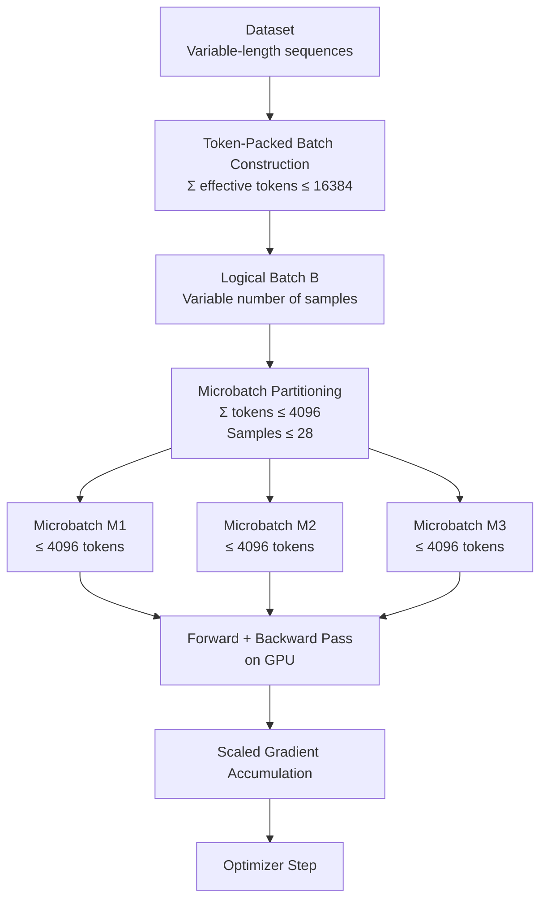

# TokenPack Trainer

A lightweight toolkit for token-budgeted batching and microbatching with Hugging Face Transformers.

Designed for long-sequence pretraining, seq2seq translation, and mixed-length corpora where fixed batch sizes waste memory. Crucially, most transformers-style syntax can still be used, this is a drop-in patch to improve memory efficiency.

This package provides:

-   `TokenPackTrainer` --- token-aware, VRAM budget Trainer with
    CPU/GPU microbatching\
-   `T5SpanCorruptionCollatorFast` --- efficient span corruption for
    T5-style pretraining\
-   `CappedSeq2SeqCollator` --- hard-capped dynamic padding for
    seq2seq fine-tuning

------------------------------------------------------------------------

## Installation

From source:

``` bash
pip install -e .
```

From GitHub:

``` bash
pip install git+https://github.com/leedrake5/tokenpack-trainer.git
```

------------------------------------------------------------------------

## Core Concepts

### Why Token-Based Batching?

Traditional training uses:

    batch_size × max_sequence_length

This wastes VRAM when sequences vary widely. Token-based batching instead enforces:

    sum(tokens_in_batch) ≤ token_budget

This allows:

-   Packing many short samples together
-   Automatically shrinking batches for long samples
-   Stable VRAM usage across wildly variable datasets

------------------------------------------------------------------------

## 1. TokenPackTrainer

A drop-in replacement for `transformers.Seq2SeqTrainer` that supports:

-   Token-based microbatching\
-   Optional CPU-planned → GPU-executed microbatches\
-   Optional hard truncation caps\
-   OOM-safe checkpointing\
-   Token-aware evaluation\
-   Compatible with:
    -   T5 / mT5 / UMT5
    -   NLLB-style seq2seq models
    -   Flash-Attention models
    -   DeepSpeed & Accelerate

------------------------------------------------------------------------

### Minimal Usage

``` python
from tokenpack_trainer import TokenPackTrainer

trainer = TokenPackTrainer(
    model=model,
    args=training_args,
    train_dataset=train_dataset,
    eval_dataset=eval_dataset,
    data_collator=data_collator,

    max_tokens_per_batch=4096,
    max_tokens_per_microbatch=512,
    length_column_name="input_length",
    use_cpu_microbatch=True,
)
```

------------------------------------------------------------------------

### Common Advanced Configuration
For UMT5-Base, I found the following configuration to be stable on an RTX 6000 Pro Blackwell (96Gb VRAM):

``` python
trainer = TokenPackTrainer(
    model=model,
    args=training_args,
    train_dataset=train_dataset,
    eval_dataset=eval_dataset,
    data_collator=data_collator,

    max_tokens_per_batch=16384,
    max_tokens_per_microbatch=4096,
    max_eval_tokens_per_microbatch=4096,
    max_examples_per_microbatch=28,
    
    max_encoder_len=512,
    max_decoder_len=512,

    length_column_name="input_length",
    use_cpu_microbatch=False,

    log_longest_every=0,
    debug=False,
)
```


------------------------------------------------------------------------

## 2. T5SpanCorruptionCollatorFast

A fast, production-ready data collator for T5-style span corruption pretraining.

Implements:

-   Random span masking
-   Sentinel token insertion
-   Encoder-target corruption format
-   Dynamic padding
-   Length tracking for token-based trainers

### Usage Example

``` python
from tokenpack_trainer.collators import T5SpanCorruptionCollatorFast

collator = T5SpanCorruptionCollatorFast(
    tokenizer=tokenizer,
    noise_density=0.15,
    mean_noise_span_length=3.0,
    pad_to_multiple_of=8,
    length_column_name="input_length",
)
```

------------------------------------------------------------------------

## 3. CappedSeq2SeqCollator

A dynamic padding collator for translation / instruction tuning
with:

-   Per-batch padding
-   Optional hard caps
-   Optional decoder input control
-   Length tracking for token-based batching

### Usage Example

``` python
from tokenpack_trainer.collators import CappedSeq2SeqCollator

collator = CappedSeq2SeqCollator(
    tokenizer=tokenizer,
    max_encoder_len=512,
    max_decoder_len=256,
    pad_to_multiple_of=8,
    length_column_name="input_length",
)
```

------------------------------------------------------------------------

## Metrics Integration

Use the provided metrics factory:

``` python
from tokenpack_trainer.metrics import make_seq2seq_compute_metrics

compute_metrics = make_seq2seq_compute_metrics(
    tokenizer=tokenizer,
    eval_dataset=eval_dataset,
    source_column="source",
    meteor_only_for_english=True,
)

trainer = HierarchicalTokenTrainer(
    ...,
    compute_metrics=compute_metrics,
)
```

------------------------------------------------------------------------

## Supported Training Types

  Task Type                Supported
  ------------------------ -----------
  T5 Pretraining           ✅
  Translation              ✅
  Instruction Tuning       ✅
  Mixed-Length Corpora     ✅
  Flash-Attention Models   ✅
  DeepSpeed                ✅
  Token Packing            ✅


------------------------------------------------------------------------

## How Token Budgeting Works

At the core of `TokenPackTrainer` is a two-level token budgeting system that replaces the traditional fixed `batch_size` with token-based control of matrix dimensions. This allows the trainer to:

- Maintain stable GPU memory usage
- Avoid pathological padding
- Maximize throughput on mixed-length corpora
- Guarantee OOM safety without dropping data

The mechanism is controlled by four key parameters:

```python
max_tokens_per_batch = 16384
max_tokens_per_microbatch = 4096
max_eval_tokens_per_microbatch = 4096
max_examples_per_microbatch = 28`
```

These bounds directly determine the maximum matrix sizes seen by the GPU.

### 1. Per-Example Effective Token Cost

For each example ( i ), the trainer computes:

```math
\ell_i^{enc} = \sum_t \text{attention\_mask}_{i,t}
\ell_i^{dec} = \sum_t \mathbf{1}[\text{labels}_{i,t} \neq -100]
```

These are combined into an effective token cost:

```math
\tilde{\ell}_i = \ell_i^{enc} + \alpha \cdot \ell_i^{dec}, \quad \alpha = 2.0
```

This reflects that decoder-side computation is typically more expensive than encoder-only attention. All subsequent budgeting is applied to sums of $\tilde{\ell}_i$
 


### 2. Stage 1 — Token-Packed Batches (Global Budget)

The DataLoader does not emit fixed-size batches. Instead, it builds a batch ( B ) such that:

```math
\sum_{i \in B} \tilde{\ell}_i \le 16384
```

This means:
    •    If samples are short → many fit into the batch
    •    If samples are long → only a few fit into the batch

So every optimizer step contains roughly the same total token workload, not the same number of examples. This removes most wasted padding and ensures stable throughput.

### 3. Stage 2 — Microbatch Splitting (GPU Budget)

Inside training_step, the packed batch is further split into microbatches ( M_k ) that satisfy:

```math
\sum_{i \in M_k} \tilde{\ell}_i \le 4096
|M_k| \le 28
```

This guarantees that no forward/backward pass ever exceeds the GPU’s safe matrix budget (assuming memory limits are well understood). Microbatches are formed greedily after sorting by length.

### 4. Matrix Math Bound

Let:
```math
B_{\max} = 28
```
```math
T_{\max} = largest sequence length inside a microbatch
```

Then the dominant per-layer activation memory scales as:

```math
\mathcal{O}(B_{\max} \cdot T_{\max} \cdot d_{model})
```

Total training memory scales as:

```math
\mathcal{O}(L \cdot B_{\max} \cdot T_{\max} \cdot d_{model})
```

This means:

The GPU never sees the full 16,384-token batch at once — it only ever processes safe 4,096-token windows.

### 5. Gradient Equivalence to a Full Batch

Even though computation is split into microbatches, the resulting gradient is mathematically identical to computing the loss on the full batch.

If:

```math
B = \bigcup_k M_k, \quad N = |B|
```

Each microbatch loss is scaled as:

```math
\mathcal{L}_k^{scaled} =
\left( \frac{1}{|M_k|} \sum_{i \in M_k} \ell_i \right)
\cdot \frac{|M_k|}{N}
```

Summing over all microbatches:

```math
\sum_k \mathcal{L}_k^{scaled} = \frac{1}{N} \sum_{i \in B} \ell_i
```

This is exactly the same result as computing the loss on the full batch at once.

### End-to-End Token Budgeting Flow



7. Summary (Numbers in Practice)

With:

max_tokens_per_batch = 16384
max_tokens_per_microbatch = 4096
max_eval_tokens_per_microbatch = 4096
max_examples_per_microbatch = 28

    •    Each optimizer step sees ~16k tokens of work
    •    Each GPU matmul never exceeds ~4k tokens
    •    Each microbatch never exceeds 28 samples
    •    Gradients are exactly equivalent to full-batch training
    •    Long sequences automatically shrink the batch safely
    •    Short sequences pack densely for throughput

This turns token count — not batch size — into the primary unit of compute control.

------------------------------------------------------------------------

## License

MIT License (or update to match your project).
